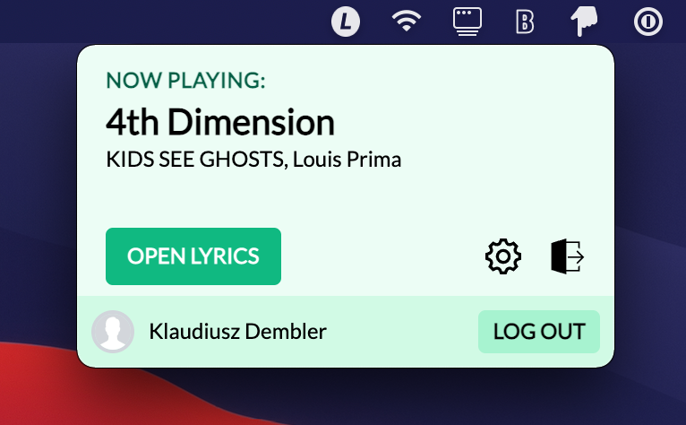

  <h1>
    
  </h1>

<strong>Lyrix - music lyrics in your status bar</strong>

Lyrix is a status bar/tray app that lets you quickly access lyrics for your currently playing Spotify song.

**Features:**

- Uses Spotify API to figure out the currently playing song
- Provides a link to the first [Genius](https://genius.com) search result
- Can run at startup
- Your data never leaves your device

  

### Contributing

All kinds of contributions are welcome, feel free to open a PR/issue.

### Credits

All icons used in the app come from [iconmonstr](https://iconmonstr.com/).

Bootstrapped by [this great Vite Electron starter](https://github.com/maxstue/vite-reactts-electron-starter).
